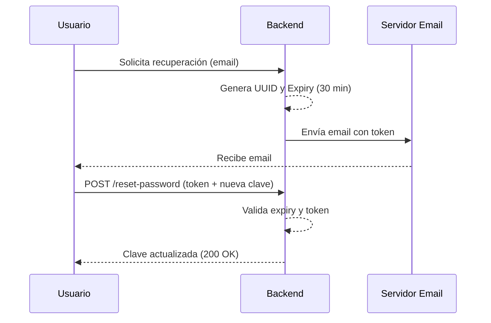

# Historias de Usuario (V2)

Este documento detalla los requerimientos funcionales del sistema Banco Digital, organizados por prioridad y con criterios de aceptación extendidos que cubren validaciones de negocio e implementación técnica.

## Tabla de Prioridades (MoSCoW)
- **M** (Must Have): Funcionalidad crítica para la operación.
- **S** (Should Have): Funcionalidad importante pero no bloqueante.
- **C** (Could Have): Funcionalidad de mejora de experiencia de usuario.

---

## HU1: Visualización de Saldo [M - Crítica]
**Como** usuario autenticado,  
**Quiero** ver el saldo de mis cuentas (Caja de Ahorro y Cuenta Corriente) en tiempo real en mi dashboard,  
**Para** tener un control inmediato de mis fondos disponibles.

### Criterios de Aceptación:
1. **Visibilidad Inmediata**: Al cargar el dashboard, se deben realizar llamadas paralelas a `/api/accounts` para obtener el saldo actual.
2. **Formato Monetario**: El saldo debe mostrarse en moneda local con separador de miles y dos decimales (ej: $1.250,50).
3. **Diferenciación de Cuentas**: Debe ser claro qué saldo pertenece a la Cuenta Corriente (`CHECKING`) y cuál a la Caja de Ahorros (`SAVINGS`).
4. **Resistencia a Errores**: Si la API falla, se debe mostrar un mensaje de "No se pudo cargar el saldo" en lugar de un valor de $0.00.

---

## HU2: Registro de Usuario [M - Crítica]
**Como** nuevo cliente,  
**Quiero** crear una cuenta proporcionando mis datos básicos,  
**Para** acceder a los servicios del banco.

### Criterios de Aceptación:
1. **Validación de Email**: El sistema debe rechazar emails que ya existan en la base de datos (Error 400 - "Email already in use").
2. **Encriptación**: La contraseña debe almacenarse usando `BCrypt` (clase `PasswordEncoder` en `AuthService`).
3. **Persistencia Automática**: Al registrarse, el sistema debe crear automáticamente una cuenta de cada tipo con 16 dígitos aleatorios.
4. **Estado Inicial**: El usuario se crea con `isVerified = false`, restringiendo ciertas operaciones hasta la validación de identidad.

---

## HU3: Verificación de Identidad (KYC) [M - Crítica]
**Como** usuario registrado,  
**Quiero** validar mi identidad mediante documentos y biometría,  
**Para** habilitar el uso total de mis cuentas.

### Criterios de Aceptación:
1. **Captura de Imagen**: Debe permitir capturar la foto (selfie) desde la cámara web o subirla desde archivos localmente.
2. **Integración con DB**: La ruta de la imagen debe guardarse en el campo `selfie` del modelo `User`.
3. **Cambio de Estado**: Al completar la carga exitosa, el campo `isVerified` en la base de datos debe pasar a `true`.
4. **Feedback Visual**: El usuario debe recibir una confirmación inmediata de "Cuenta Verificada".

---

## HU4: Transferencias entre Cuentas y a Terceros [M - Crítica]
**Como** usuario,  
**Quiero** enviar dinero a otra cuenta (propia o ajena),  
**Para** cumplir con mis obligaciones de pago.

### Criterios de Aceptación:
1. **Validación de Saldo**: El sistema debe impedir la transferencia si el monto es mayor al saldo disponible (Error: "Saldo insuficiente").
2. **Atomicidad**: La operación debe ser `@Transactional`. Si falla el incremento en el destino, no se debe descontar del origen.
3. **Registro de Movimiento**: Se debe crear una entrada en la tabla `transactions` con el tipo `TRANSFER` y la descripción proporcionada.
4. **Integración Externa**: En transferencias externas, se debe validar que el CBU/CVU de destino exista en el sistema de cuentas externas.

---

## HU5: Inicio de Sesión [M - Crítica]
**Como** usuario,  
**Quiero** autenticarme con mis credenciales,  
**Para** operar de forma segura.

### Criterios de Aceptación:
1. **Seguridad JWT**: Tras un login exitoso, se debe generar un token JWT válido por el tiempo configurado.
2. **Manejo de Errores**: Credenciales incorrectas deben devolver un error genérico ("Invalid credentials") por seguridad.
3. **Carga de Perfil**: El sistema debe devolver el objeto de usuario (sin password) para hidratar el estado del frontend.

---

## HU6: Recuperación de Contraseña [S - Importante]
**Como** usuario,  
**Quiero** restablecer mi clave si la olvido,  
**Para** no perder acceso a mis fondos.

### Criterios de Aceptación:
1. **Expiración**: El token debe expirar estrictamente en 30 minutos (validado en `AuthService.java`).
2. **Unicidad**: El token debe ser un UUID aleatorio y único.
3. **Seguridad**: Una vez usado, el token debe quedar invalidado (set `null`).

---

## HU7: Historial de Movimientos [S - Importante]
**Como** usuario,  
**Quiero** ver mi historial de transacciones,  
**Para** controlar mis gastos e ingresos.

### Criterios de Aceptación:
1. **Orden Cronológico**: Los movimientos deben mostrarse del más reciente al más antiguo.
2. **Detalle Completo**: Cada item debe mostrar monto, tipo, fecha y descripción.
3. **Filtro por Cuenta**: Debe permitir ver el historial de una cuenta específica o de todas las asociadas.

---

## HU8: Actualización Automática de Saldo [S - Importante]
**Como** usuario,  
**Quiero** que la interfaz refleje mi nuevo saldo tras una operación,  
**Para** tener información exacta.

### Criterios de Aceptación:
1. **Refresco Post-Envío**: Al finalizar una transferencia con éxito, se debe ejecutar un refresco de los datos del dashboard.
2. **Realtime Simulated**: El frontend debe esperar la confirmación 200 OK del backend antes de actualizar el saldo localmente.
